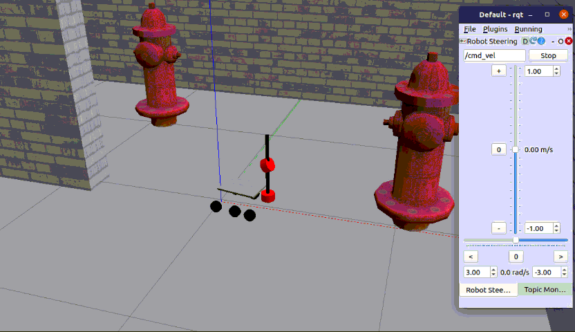
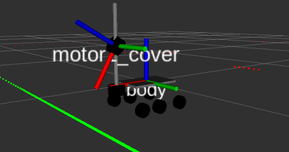

# CppND-Capstone

This repository is associated to the [Udacity C++ Nanodegree Program](https://www.udacity.com/course/c-plus-plus-nanodegree--nd213) Capstone project.

I have implemented a Slanted Lidar on top of a movable tower, based on ROS2 (which uses the C++ 14 standard).



Based on the desired velocity a Gazebo plugin will change dynamically the position of a servo to accomodate to different angle locations.

## Background

The `ls_bot` is an extension from the [rocker-bogie project](https://github.com/SyrianSpock/rover). Several changes were needed to make to compile using the ROS2 foxy default infrastructure. The autonomous rover includes two Lidar sensors, one at the botton and another movable (on top of a servo) on the tower.



The objective is to deploy a `Gazebo plugin` to automatically change its `pitch` orientation based on the desired velocity.

## Results

The execution results can be checked in [this video](./data/slantedLidar01.mp4).

### Rubrik considerations

#### Compiling and Testing

1. Clone this repo.
2. Marke sure to install [ROS2 foxy](https://docs.ros.org/en/foxy/Installation.html) or higher.
3. Compile the project with `colcon build --symlink-install`.
4. Source the environment using `source install/setup.bash`.
5. Run it: `ros2 launch lsbot_gazebo world.py`.

#### Loops, Functions, I/O

Usage of several C++ functions and control structures can be checked on the [lsbot_gazebo_joint_plugin.cpp](src/lsbot/lsbot_gazebo_plugins/src/lsbot_gazebo_joint_plugin.cpp) source file.

The following user input parameters can be added to the launcher with key:=value format:
```
rviz:=true|false
gui:=true|false
rqt:=true|false
verbose:=true|false
```

#### Object Oriented Programming

Everything is organized into classes with class attributes to hold the data, and class methods to perform tasks.

All class data members are explicitly specified as public, protected, or private as detailed on the [lsbot_gazebo_joint_plugin.cpp](src/lsbot/lsbot_gazebo_plugins/include/lsbot_gazebo_plugins/lsbot_gazebo_joint_plugin.hpp) header file; all class member functions document their effects.

State is accessed via member functions.

Composition is used instead of inheritance.

#### Memory Management

The project makes use of references in function declarations.

The project uses destructors appropriately.

The project uses smart pointers instead of raw pointers.

#### Concurrency

The project uses multiple threads in the execution by using timers and subscribing to different topics via callbacks.

Several mutexes are used to lock access to common resources.

### Troubleshooting

## Discussion

## Conclusion / Future Work

## Resources

 * [Gazebo Plugins](http://gazebosim.org/tutorials?tut=ros_gzplugins)

